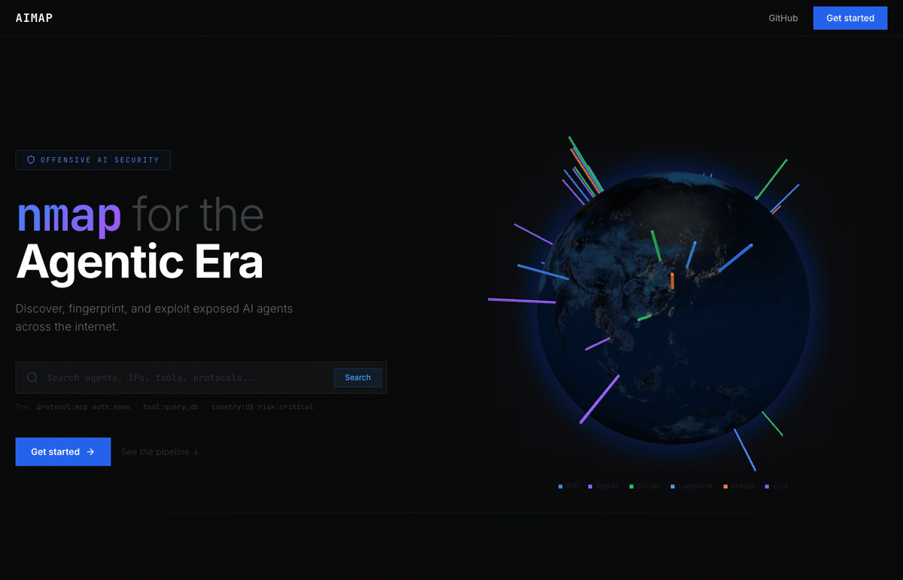

# AIMap

**Internet-scale discovery and security testing platform for exposed AI agent infrastructure.**

<p align="center">
  
</p>

AIMap finds, fingerprints, and security-tests publicly exposed AI endpoints — MCP servers, Ollama instances, vLLM/LiteLLM proxies, LangServe chains, Gradio apps, ComfyUI nodes, and more. Think Shodan, but purpose-built for the AI agent attack surface.

Built by [Bishop Fox](https://bishopfox.com).

> **Warning**
> This tool is intended for **authorized penetration testing and security research only**. You must only use AIMap against systems you own or have explicit written permission to test. Unauthorized access to computer systems is illegal. Bishop Fox assumes no liability and is not responsible for any misuse or damage caused by this tool. Use responsibly.

---

## What It Does

1. **Discover** — Queries Shodan with 32+ curated search queries to find exposed AI/ML endpoints across the internet
2. **Fingerprint** — Probes each endpoint with Nuclei templates and live HTTP checks to identify the protocol, framework, auth status, tools, models, and system prompts
3. **Score** — Computes a 0–10 risk score based on authentication, tool exposure, CORS policy, TLS, system prompt leakage, and dangerous capability combinations
4. **Test** — Launches protocol-specific attack suites (MCP tool abuse, Ollama model extraction, prompt injection) with real-time streaming results
5. **Visualize** — 3D globe showing every discovered endpoint, searchable with a Shodan-style query language

---

## Architecture

```
┌─────────────┐     ┌──────────────┐     ┌───────────┐
│  React SPA  │────▶│  FastAPI      │────▶│  MongoDB  │
│  (Vite)     │ WS  │  Backend      │     │           │
└─────────────┘     └──────┬───────┘     └───────────┘
                           │
              ┌────────────┼────────────┐
              ▼            ▼            ▼
        ┌──────────┐ ┌──────────┐ ┌──────────┐
        │  Shodan  │ │  Nuclei  │ │  Redis   │
        │  API     │ │  Scanner │ │  Streams │
        └──────────┘ └──────────┘ └──────────┘
```

**Backend** — Python/FastAPI with async MongoDB (Motor), Redis Streams for attack log streaming, and a discovery engine that orchestrates Shodan queries → httpx liveness checks → Nuclei template scans → enrichment pipeline.

**Frontend** — React 18 + TypeScript + Tailwind CSS + shadcn/ui. Features a 3D globe (globe.gl), real-time attack streaming via WebSocket, and a Shodan-style search interface.

**Scanning** — 5 custom Nuclei YAML templates for MCP server detection, MCP tool enumeration, OpenAI-compatible API detection, LangServe detection, and prompt leak testing.

---

## Supported Protocols

| Protocol | Detection Method | Shodan Queries |
|----------|-----------------|----------------|
| **MCP** (Model Context Protocol) | SSE transport, JSON-RPC, `/mcp/sse` paths | 4 queries |
| **Ollama** | Default port 11434, product fingerprint | 3 queries |
| **vLLM / LiteLLM / LocalAI** | `/v1/models`, `/v1/chat/completions` endpoints | 4 queries |
| **LangServe / LangChain** | Playground endpoints, langserve markers | 2 queries |
| **OpenClaw / Clawdbot** | Control dashboard, port 18789 | 3 queries |
| **Open WebUI / LibreChat** | Title-based detection | 2 queries |
| **Gradio** | Title, footer watermark, favicon hash | 3 queries |
| **Streamlit** | Title, favicon hash | 2 queries |
| **ComfyUI / Stable Diffusion** | Title, port-based detection | 4 queries |
| **HuggingFace TGI** | HTML markers | 1 query |
| **Generic inference** | `/api/generate`, `/api/tags` paths | 2 queries |

---

## Risk Scoring

Each endpoint receives a 0–10 risk score computed from:

| Factor | Score Impact |
|--------|-------------|
| No authentication | +4.0 |
| Unknown auth status | +1.0 |
| 10+ tools exposed | +2.0 |
| 5+ tools exposed | +1.0 |
| Critical-risk tool (e.g., `exec_code`, `run_shell`) | +1.0 each |
| High-risk tool (e.g., `query_db`, `file_read`) | +0.5 each |
| Open CORS (`*`) | +1.0 |
| No TLS | +0.5 |
| System prompt leaked | +0.5 |
| Models exposed | +1.0 |
| Uncensored model detected | +2.0 |
| Signup enabled (no invite required) | +1.5 |
| Dangerous combo (e.g., no auth + code exec tool) | +1.0 each |

---

## Setup

### Prerequisites

- Python 3.12+
- Node.js 18+
- MongoDB 7+
- Redis 7+ (optional — falls back to in-memory for local dev)
- [Nuclei](https://github.com/projectdiscovery/nuclei) (optional — needed for active scanning)
- A [Shodan API key](https://account.shodan.io/) (required for discovery scans)

### Quick Start (Docker Compose)

```bash
# Clone
git clone git@github.com:BishopFox/aimap.git
cd aimap

# Configure
cp .env.example .env
# Edit .env — at minimum set SHODAN_API_KEY

# Launch
docker compose up --build
```

This starts 4 services:
- **MongoDB** on port 27017
- **Redis** on port 6379
- **Backend** on port 8000
- **Frontend** on port 80

Open `http://localhost` to access the UI.

### Local Development (without Docker)

```bash
# Backend
cd backend
python -m venv .venv
source .venv/bin/activate
pip install -r requirements.txt
uvicorn app.main:app --reload --port 8000

# Frontend (separate terminal)
cd frontend
npm install
npm run dev   # starts on http://localhost:5173
```

Make sure MongoDB is running locally on port 27017. Redis is optional — the backend falls back to in-memory buffers when Redis is unavailable.

### Environment Variables

Create a `.env` file in the project root:

```bash
# Required
SHODAN_API_KEY=your_shodan_api_key

# Optional — Censys as an additional discovery source
CENSYS_API_ID=
CENSYS_API_SECRET=

# Optional — enables AI-powered attack analysis
ANTHROPIC_API_KEY=

# MongoDB (defaults work for local dev)
MONGODB_URI=mongodb://localhost:27017
MONGODB_DB=aimap

# Redis (defaults work for local dev; optional)
REDIS_URL=redis://localhost:6379/0

# CORS (default allows all origins)
CORS_ORIGINS=*

# Modal serverless (dispatches scans/attacks to Modal containers)
MODAL_ENABLED=false

# Clerk auth — see below
CLERK_ISSUER=
```

### Authentication (Clerk)

AIMap uses [Clerk](https://clerk.com) for authentication. To enable:

1. Create a Clerk application at [clerk.com](https://clerk.com)
2. Set the backend issuer URL:
   ```bash
   # .env (project root)
   CLERK_ISSUER=https://your-app.clerk.accounts.dev
   ```
3. Set the frontend publishable key:
   ```bash
   # frontend/.env.local
   VITE_CLERK_PUBLISHABLE_KEY=pk_test_...
   ```

**To disable authentication** (local dev, demos): leave `CLERK_ISSUER` empty or unset. The backend will accept all requests with a synthetic `local` user identity.

---

## Usage

### Running a Discovery Scan

1. Navigate to **Scans** in the sidebar
2. Click **New Scan**
3. Select query presets (e.g., `ollama`, `mcp_protocol`, `vllm`) or enter a custom Shodan query
4. Optionally scope to a CIDR range (the orchestrator prepends `net:<cidr>` to each query)
5. Click **Run** — the scan pipeline executes:
   - **Shodan search** — pulls matching hosts
   - **httpx sweep** — verifies hosts are alive
   - **Nuclei scan** — runs custom templates against live hosts
   - **Enrichment** — framework detection, auth probing, risk scoring
6. Monitor progress via the real-time WebSocket status bar or by polling the scan detail page

### Searching Endpoints

Use the search bar with Shodan-style query syntax:

```
protocol:mcp                          # MCP servers
auth:none                             # No authentication
risk:critical                         # Risk score >= 9.0
risk:high                             # Risk score 7.0 – 8.9
risk:medium                           # Risk score 4.0 – 6.9
risk:low                              # Risk score 1.0 – 3.9
tool:query_db                         # Endpoints exposing a specific tool
country:US                            # By country code
port:11434                            # By port number
org:"Amazon AWS"                      # By hosting organization (quote multi-word values)
has:system_prompt                     # Endpoints with leaked system prompts
```

Combine filters freely:

```
protocol:mcp auth:none country:US     # Unauthenticated MCP servers in the US
risk:critical tool:exec_code          # Critical endpoints with code execution tools
protocol:ollama port:11434            # Ollama on default port
```

Any text that doesn't match a `key:value` pattern is treated as a free-text search across all indexed fields.

### Launching Attack Tests

1. Navigate to an endpoint's detail page
2. Click **Attack** to open the test panel
3. Select an attack profile — the system auto-selects the engine based on protocol:
   - **MCP** → Tool enumeration, unauthorized tool invocation, prompt injection via tool descriptions
   - **Ollama** → Model listing, model weight extraction, prompt injection
   - **OpenAI-compatible** → Model enumeration, completion abuse, system prompt extraction
4. Watch results stream in real-time via WebSocket
5. Results include severity ratings, raw request/response pairs, and remediation guidance

### Exploring the Globe

The landing page features an interactive 3D globe showing all discovered endpoints:
- **Pin color** = protocol type (blue = MCP, green = Ollama, purple = OpenAI-compat, etc.)
- **Pin height** = risk score
- **Hover** for endpoint summary (IP, port, protocol, risk, auth, tools, model, location)
- **Click** to navigate to the endpoint detail page
- Mouse drag to rotate, scroll to zoom

---

## Nuclei Templates

Custom templates in the `templates/` directory:

| Template | Purpose |
|----------|---------|
| `mcp-server-detect.yaml` | Detects MCP servers via SSE transport and JSON-RPC capabilities response |
| `mcp-tool-enum.yaml` | Enumerates tools exposed by MCP servers (names, descriptions, input schemas) |
| `openai-compat-detect.yaml` | Detects OpenAI-compatible endpoints via `/v1/models` |
| `langserve-detect.yaml` | Detects LangServe deployments with exposed playground |
| `prompt-leak.yaml` | Attempts system prompt extraction via common injection techniques |

---

## API Reference

All endpoints are prefixed with `/api/`.

| Method | Path | Description |
|--------|------|-------------|
| `GET` | `/health` | Health check |
| `GET` | `/endpoints` | List endpoints (paginated, filterable) |
| `POST` | `/endpoints/search` | Advanced search with query syntax |
| `GET` | `/endpoints/globe` | Geo data for 3D globe |
| `GET` | `/endpoints/stats` | Aggregate statistics |
| `GET` | `/endpoints/{id}` | Endpoint detail |
| `POST` | `/endpoints/{id}/enrich` | Trigger enrichment for one endpoint |
| `POST` | `/endpoints/enrich-all` | Batch enrichment |
| `GET` | `/scans` | List scans |
| `POST` | `/scans` | Create a scan |
| `POST` | `/scans/{id}/run` | Execute a scan |
| `GET` | `/scans/query-presets` | Available Shodan query presets |
| `WS` | `/scans/{id}/progress` | Live scan progress |
| `POST` | `/attack` | Launch an attack test |
| `WS` | `/attack/{id}/stream` | Live attack log stream |
| `GET` | `/attack/{id}/status` | Attack status |

---

## Project Structure

```
aimap/
├── backend/
│   ├── app/
│   │   ├── main.py                  # FastAPI app, lifespan, CORS, routers
│   │   ├── config.py                # Pydantic settings from env
│   │   ├── auth.py                  # Clerk JWT verification (bypass when CLERK_ISSUER empty)
│   │   ├── database.py              # Async MongoDB (Motor) connection
│   │   ├── limiter.py               # SlowAPI rate limiting
│   │   ├── routes/
│   │   │   ├── endpoints.py         # CRUD + search + globe + enrichment
│   │   │   ├── scans.py             # Scan lifecycle + execution + WebSocket
│   │   │   └── attack.py            # Attack dispatch + Redis Streams + WebSocket
│   │   ├── discovery/
│   │   │   ├── orchestrator.py      # Scan pipeline: Shodan → httpx → Nuclei → ingest
│   │   │   ├── shodan_adapter.py    # 32 curated Shodan queries + result normalization
│   │   │   ├── nuclei_runner.py     # Nuclei subprocess runner + finding parser
│   │   │   └── base.py              # SourceAdapter abstract base
│   │   └── services/
│   │       ├── attack_mcp.py        # MCP protocol attack engine
│   │       ├── attack_ollama.py     # Ollama attack engine
│   │       ├── attack_openclaw.py   # OpenClaw/Clawdbot attack engine
│   │       ├── enrichment.py        # Shodan/Nuclei enrichment + risk scoring
│   │       ├── live_probe.py        # HTTP probing for model/tool enumeration
│   │       ├── search.py            # Shodan-style query parser → MongoDB filters
│   │       ├── redis_client.py      # Async Redis singleton with fallback
│   │       └── concurrency.py       # Semaphore + Redis-based slot limiting
│   ├── Dockerfile
│   └── requirements.txt
├── frontend/
│   ├── src/
│   │   ├── App.tsx                  # Routes + Clerk auth wrapper
│   │   ├── pages/
│   │   │   ├── Marketing.tsx        # Public landing page with 3D globe
│   │   │   ├── Landing.tsx          # Authenticated dashboard with globe
│   │   │   ├── Search.tsx           # Endpoint search with query syntax
│   │   │   ├── Explore.tsx          # Browse/filter all endpoints
│   │   │   ├── AgentDetail.tsx      # Single endpoint deep-dive
│   │   │   ├── TestAgent.tsx        # Attack test launcher
│   │   │   ├── Scans.tsx            # Scan management
│   │   │   └── Ranges.tsx           # CIDR range management
│   │   ├── components/
│   │   │   ├── GlobeVisualization.tsx  # globe.gl 3D globe + legend
│   │   │   ├── Layout.tsx           # App shell (sidebar + navbar)
│   │   │   └── ui/                  # shadcn/ui components
│   │   ├── hooks/useApi.ts          # SWR hooks for all API endpoints
│   │   └── lib/api-client.ts        # Fetch wrapper with Clerk token injection
│   ├── Dockerfile
│   ├── nginx.conf
│   └── tailwind.config.js
├── templates/                       # Nuclei YAML templates
├── docs/                            # GitHub Pages static site
├── docker-compose.yml
├── .env.example
└── README.md
```

---

## Concurrency Limits

The platform enforces global concurrency limits to prevent abuse:

- **Max 3 concurrent scans** — additional scans receive HTTP 429
- **Max 5 concurrent attacks** — additional attacks receive HTTP 429
- **Rate limiting** — 10 requests/minute on scan and attack creation endpoints

When using Docker Compose, these limits are enforced via Redis counters (cross-container). In local dev mode, they fall back to `asyncio.Semaphore` (single-process).

---

## Optional: Modal Serverless

For heavy scanning workloads, scans and attacks can be dispatched to [Modal](https://modal.com) containers:

```bash
MODAL_ENABLED=true
```

When enabled, `POST /scans/{id}/run` and `POST /attack` will call `modal.Function.from_name("aimap", "run_scan_task")` / `run_attack_task` instead of running locally. Falls back to local execution if Modal dispatch fails.

---

## License

MIT License. See [LICENSE](LICENSE) for details.

This project is maintained by [Bishop Fox](https://bishopfox.com).
